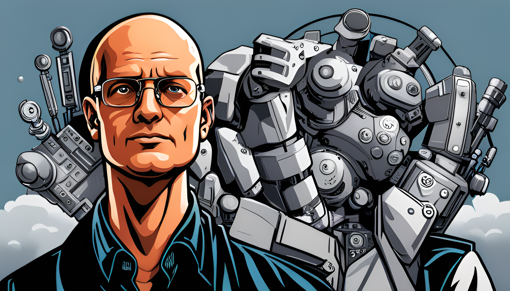

# 🧠 Geniusrise

#+html: 

Welcome to Geniusrise, where we're crafting the future of AI. Our mission? To create a "connected genius" - an AI that's not just smart, but also aware and adaptive.

### 🎯 The Connected Genius

At Geniusrise, we're developing an AI that's more than just a tool - it's a partner. Our "genius" doesn't just process data; it understands context, adapts to its environment, and learns from every interaction. It's not just about intelligence; it's about connection.

### 🌐 A World of Data

Our genius thrives on data. It integrates information from a myriad of sources - communication platforms, project management tools, document management systems, and more. It uses this data to understand its environment, adapt to changes, and provide the most relevant and effective solutions.

### 🎛️ The Art of Fine-Tuning

The genius is not born; it's made. Through a meticulous fine-tuning process, we shape our genius to fit the unique needs of each organization. Using integrated data to generate prompts, we fine-tune our target model, creating an AI that's not just smart, but also intuitive and adaptive.

### 🚀 The Future is Now

The future of AI is here, and it's called Geniusrise. Prepare for the rise of the "geniuses". 🎉
